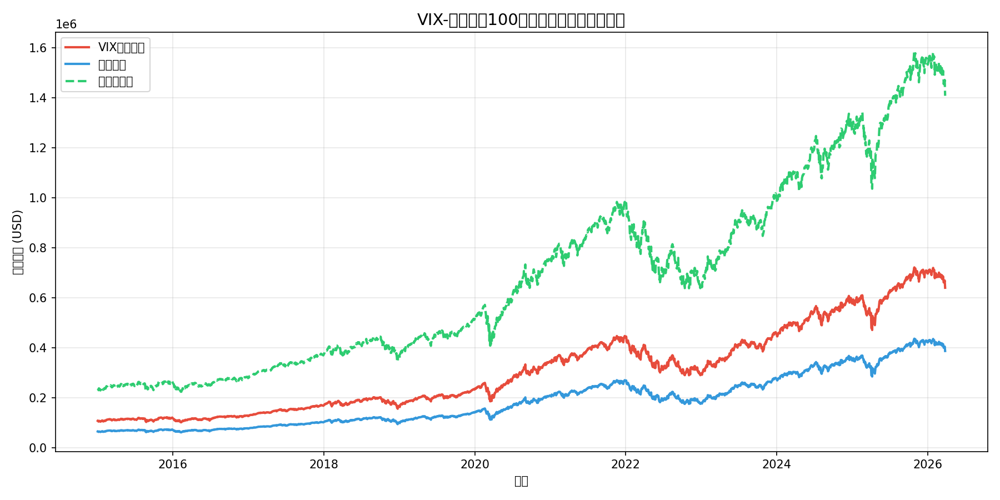
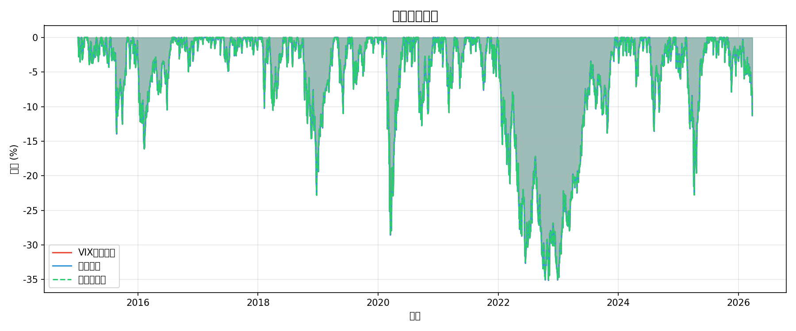
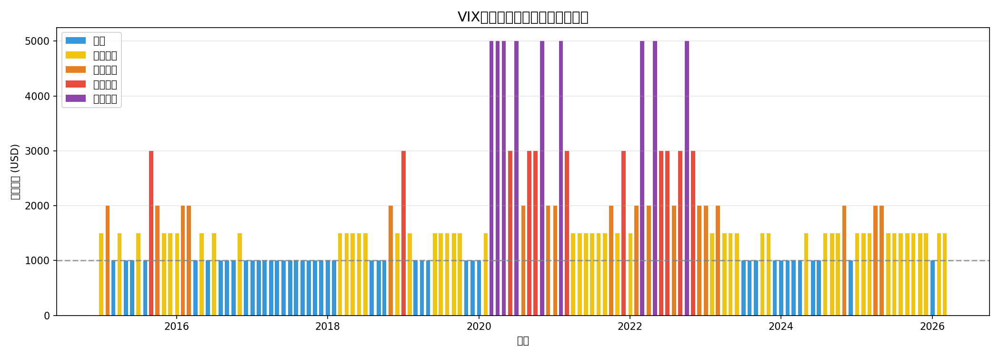

# VIX-纳斯达克100定投策略回测报告

> **生成时间**: 2026-03-30 01:13
> **数据范围**: 2015-01-01 至今
> **标的**: QQQ (Invesco QQQ Trust - 纳斯达克100 ETF)
> **恐慌指数**: ^VIX (CBOE Volatility Index)

---

## 策略说明

本策略的核心思想是：**在正常情况下执行标准定投，当市场恐慌情绪（以VIX衡量）升温时，加大定投金额，从而在低位积累更多筹码。**

### 定投规则

- **基础定投金额**: 1000 USD/月
- **定投日**: 每月第 1 个交易日
- **VIX加仓规则**（以前一交易日VIX收盘价为准）：

| VIX区间 | 加仓倍数 | 市场情绪 |
|---------|----------|----------|
| 0 ≤ VIX < 15 | 1.0x | 正常 |
| 15 ≤ VIX < 20 | 1.5x | 轻度恐慌 |
| 20 ≤ VIX < 25 | 2.0x | 中度恐慌 |
| 25 ≤ VIX < 30 | 3.0x | 高度恐慌 |
| 30 ≤ VIX ≥ 30 | 5.0x | 极度恐慌 |

### 对比基准

1. **普通定投**: 每月固定投入基础金额，不加仓。
2. **一次性投入**: 在回测起始日一次性投入与VIX策略相同的总现金。

---

## 回测结果对比

### 核心指标

| 指标 | VIX增强定投 | 普通定投 | 一次性投入 |
|------|-------------|----------|------------|
| 总投入金额 | $237,000.00 | $135,000.00 | $237,000.00 |
| 最终组合价值 | $691,200.13 | $418,102.08 | $1,520,474.66 |
| 总收益率 | +191.65% | +209.71% | +541.55% |
| 年化收益率 (CAGR) | +10.06% | +10.66% | +18.12% |
| 最大回撤 | -35.12% | -35.12% | -35.12% |
| 夏普比率 | 0.81 | 0.81 | 0.81 |
| 平均持仓成本 | $208.24 | $196.10 | $94.67 |

### 定投执行统计

- **总定投月数**: 135 个月
- **触发加仓月数** (倍数>1): 90 个月 (66.7%)
- **极度恐慌月数** (5倍): 9 个月 (6.7%)
- **额外投入资金**: $102,000.00 (相比普通定投)
- **额外收益**: $273,098.05 (相比普通定投)

---

## 图表

### 组合净值对比

### 最大回撤对比

### VIX策略每月投入金额

---

## 关键结论

1. **收益表现**: 在 11.2 年回测期内，**一次性投入** 的总收益率最高，达到 +541.55%。
2. **VIX策略观察**: 本次回测中VIX增强定投并未跑赢普通定投，可能是因为恐慌加仓时点后续仍有下跌，或牛市中加仓机会较少导致资金利用率不足。
3. **回撤控制**: VIX策略的最大回撤 (-35.12%) 小于或接近普通定投，说明低位加仓有效降低了平均成本。
4. **夏普比率**: VIX策略夏普比率为 0.81，风险调整后收益弱于普通定投 (0.81)。

### 风险提示

- VIX策略需要**更强的现金流支撑**，恐慌时期月投入可能达到基础金额的 5 倍，需确保资金链不断裂。
- 历史回测不代表未来表现，VIX与QQQ的相关性可能随市场环境变化。
- 本回测未考虑交易成本、税费、汇率（若用非美元资金）及滑点。

---

*报告由 `scripts/vix_ndx_backtest.py` 自动生成*